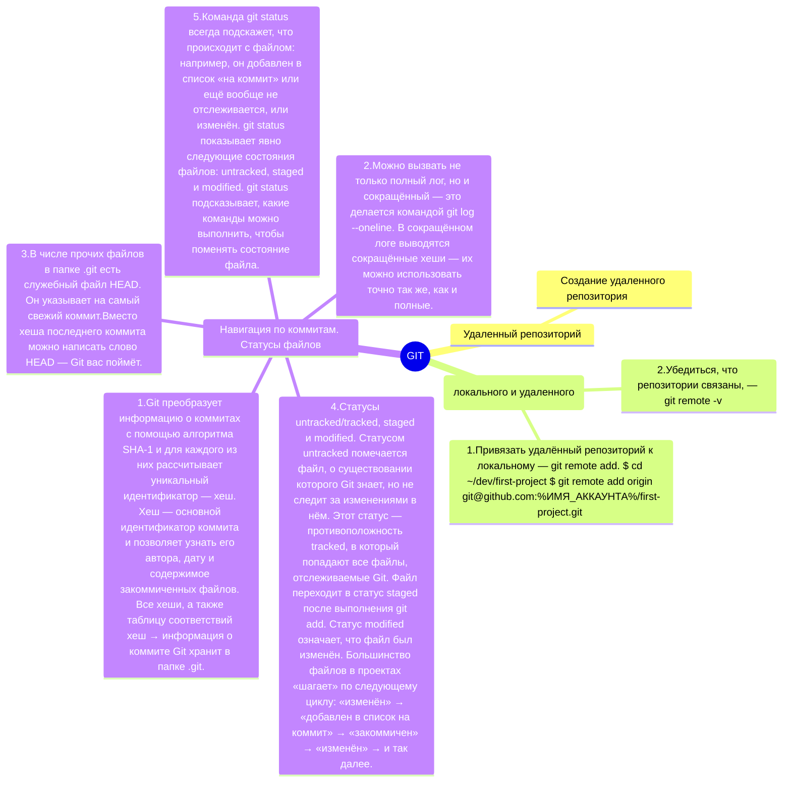

### Важное объявление

---

Этот проект является первой практикой в курсе по обучению GIT.
https://practicum.yandex.ru/git-basics/

---

#### Что сделал для решения практики?

* Инициировал новую директорию и привязал её к ГИТу
* На ГитХабе создал новый репозиторий
* Привязал локальный репозиторий к удаленному на ГитХаб
* Добавил файл readme.md с описание проекта
* Синхронизировал локальный репозиторий с удаленным (убедился, что все необходимые изменения есть на ГитХаб)

---

#### Mindmap на mermaid

